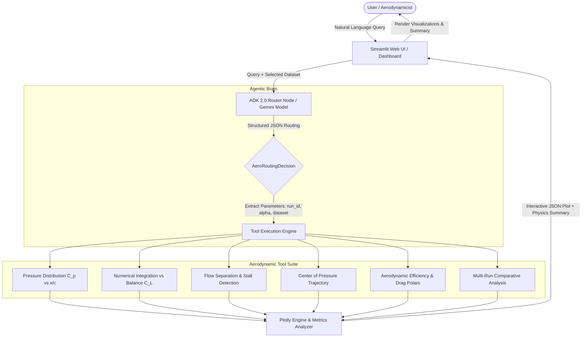

# AWTA: Agentic Wind Tunnel Analysis

> **⚠️ DISCLAIMER:** This project is currently **under active development**. Features, the tool suite, and the underlying architecture are subject to continuous updates and improvements.

[](https://appuipy-qbwm7xb4ohnzevanyvdw6d.streamlit.app/)
[](https://www.python.org/downloads/)
[](https://adk.dev/)
[](https://streamlit.io/)
[](https://www.docker.com/)

**AWTA (Agentic Wind Tunnel Analysis)** is an autonomous aerodynamic data analysis agent built with **Google Agent Development Kit (ADK) 2.0**, **Google Gemini**, and **Python**. It features an interactive **Streamlit** user interface designed for wind tunnel experimentalists, aerospace researchers, and aerodynamicists. AWTA automatically interprets natural language queries, selects specialized aerodynamic tools, performs physics-based computations (e.g., surface pressure integration, flow separation detection, aerodynamic polars, and center-of-pressure estimation), and generates publication-grade visualizations.

---
## 🌐 Live App
You can try the AWTA agent directly in your browser without any installation:

 **[Launch the AWTA Streamlit Web App](https://appuipy-qbwm7xb4ohnzevanyvdw6d.streamlit.app/)**

---

## 🚀 Quick Start / How to Run

### Prerequisites

- [Docker](https://www.docker.com/) (Recommended) **OR** [Python 3.13+](https://www.python.org/) with [`uv`](https://docs.astral.sh/uv/)
- A **Gemini API Key** from [Google AI Studio](https://aistudio.google.com/) (entered directly inside the Streamlit Web UI)


---

### Option 1: Running with Docker (Recommended)

Docker provides an isolated, reproducible environment with all system and Python dependencies pre-configured.

#### 1. Build the Docker Image
```bash
docker build -t awta .
```

#### 2. Run the Container
```bash
docker run -p 8501:8501 awta
```

#### 3. Mounting Local Data Volumes (Optional)
To mount your local experimental data and output folders into the running container (allowing you to add new CSV datasets or save plots directly to your host machine):

**Linux / macOS (Bash / Zsh):**
```bash
docker run -p 8501:8501 \
  -v "$(pwd)/data:/app/data" \
  -v "$(pwd)/app:/app/app" \
  awta
```

**Windows (PowerShell):**
```powershell
docker run -p 8501:8501 `
  -v "${PWD}/data:/app/data" `
  -v "${PWD}/app:/app/app" `
  awta
```

**Windows (Command Prompt):**
```cmd
docker run -p 8501:8501 -v "%cd%/data:/app/data" awta
```

Once running, access the web dashboard at: **`http://localhost:8501`** and input your **Gemini API Key** directly in the sidebar authentication field.

---

### Option 2: Running Locally (Development Mode)

If you prefer to run the application natively on your host machine using `uv`:

#### 1. Install Dependencies
```bash
# Install uv if you haven't already: https://docs.astral.sh/uv/
uv sync
```

#### 2. Launch the Streamlit Web Application
```bash
uv run streamlit run app/streamlit_ui.py
```

#### 3. (Optional) Run with Google Agents CLI
```bash
uv tool install google-agents-cli
agents-cli playground
```

---

## 🎯 Key Features & Aerodynamic Tool Suite

AWTA integrates specialized physics and data-analysis tools exposed to the agent via structured routing:

| Aerodynamic Capability | Description | Core Output |
| :--- | :--- | :--- |
| **Surface Pressure Distribution** (`plot_pressure_distribution`) | Analyzes chordwise pressure coefficient ($C_p$ vs. $x/c$) across upper and lower airfoil surfaces at specified angles of attack ($\alpha$). | Upper/lower $C_p$ curves, suction peak location, stagnation point. |
| **Force Integration Validation** (`compare_integrated_vs_reported`) | Numerically integrates discrete pressure tap measurements ($\oint C_p \, d(x/c)$) using the trapezoidal rule and compares against balance-reported $C_L$, $C_D$, and $C_M$. | Integrated vs. balance $C_L$, percentage discrepancy & validation metrics. |
| **Flow Separation & Stall Detection** (`detect_flow_separation`) | Identifies trailing-edge pressure plateaus ($dC_p/dx \approx 0$) and suction collapse to pinpoint flow separation inception and stall angle. | Separation onset chord location ($x_{sep}/c$), stall status indicator. |
| **Center of Pressure Trajectory** (`plot_center_of_pressure`) | Computes chordwise center of pressure ($x_{cp}/c = -C_{M,LE}/C_N$) as a function of angle of attack ($\alpha$). | $x_{cp}/c$ curve, aerodynamic center offset analysis. |
| **Aerodynamic Efficiency & Drag Polars** (`plot_aerodynamic_efficiency`) | Evaluates lift-to-drag ratio ($L/D = C_L/C_D$) vs. $\alpha$ and classical drag polar ($C_L$ vs. $C_D$). | $(L/D)_{max}$, optimal angle of attack $\alpha_{opt}$, zero-lift drag estimate. |
| **Pressure Coefficient Time Evolution** (`plot_pressure_time_window`) | Visualizes dynamic unsteady chordwise $C_p$ evolution across user-specified time windows with color-mapped time steps and multi-run subplots. | Time-resolved $C_p$ waterfall/evolution profiles, temporal suction dynamics. |
| **Time-Series Trends & Multi-Run Comparisons** (`plot_time_trend`, `plot_runs_comparison`) | Analyzes dynamic test telemetry across time intervals and compares aerodynamic coefficients across multiple wind tunnel test runs. | Multi-run overlay polars, Reynolds/Mach number sensitivity plots. |

---

## 🧠 System Architecture & Workflow



1. **User Interaction**: Users select target wind tunnel run files and enter natural language instructions via the Streamlit interface.
2. **Intent Parsing & Parameter Extraction**: The Google ADK 2.0 ReAct agent utilizes Gemini to parse complex queries, extract target angles of attack, run numbers, and determine the optimal aerodynamic tool.
3. **Physics Computation & Visualization**: Specialized modules compute aerodynamic coefficients, perform numerical integration over pressure taps, and generate publication-quality figures.
4. **Interactive Dashboard Feedback**: Figures, data previews, and physical interpretations are rendered live in Streamlit.

---

## 📊 Dataset Structure

AWTA is configured to analyze wind tunnel experimental matrices. The default dataset is sourced from the **Ohio State University (OSU)** wind tunnel tests for the **L303 airfoil**, publicly available via the [OSU Airfoils Dataset](https://www.nlr.gov/wind/nwtc/airfoils-osu-data).:

- **`data/merged_data_L303.csv`**: Comprehensive experimental matrix containing:
  - **Run Identification**: `RunNo`, `PointNo`, `Timestamp`
  - **Kinematic & State Parameters**: Angle of Attack (`Alpha` / $\alpha$), Dynamic Pressure ($q$), Mach number, Reynolds number
  - **Force & Moment Balance Data**: Total lift coefficient ($C_L$), drag coefficient ($C_D$), pitching moment coefficient ($C_M$)
  - **Pressure Port Telemetry**: Chordwise upper and lower surface tap pressure coefficients ($C_{p,1} \dots C_{p,N}$)
- **`data/xc_locations.csv`**: Normalized non-dimensional chordwise coordinates ($x/c \in [0, 1]$) for all static pressure orifices along the airfoil geometry.

---

## 📁 Project Structure

```
aero-assistant/
├── app/
│   ├── agent.py               # Main ADK 2.0 ReAct workflow agent & router
│   ├── streamlit_ui.py        # Streamlit web dashboard
│   ├── fast_api_app.py        # Backend API service interface
│   └── app_utils/
│       ├── advanced_aero_tools.py # Pressure distribution, stall, x_cp, & polar tools
│       ├── data_tools.py          # Data filtering, extraction, & run metadata tools
│       ├── plot_tools.py          # Time trends & multi-run comparison plots
│       ├── telemetry.py           # Observability & telemetry hooks
│       └── typing.py              # Pydantic schemas & state models
├── data/
│   ├── merged_data_L303.csv   # Wind tunnel experimental test matrix
│   └── xc_locations.csv       # Airfoil pressure tap coordinates (x/c)
├── tests/
│   ├── unit/                  # Unit tests for aerodynamic calculations & tools
│   └── integration/           # End-to-end agent workflow integration tests
├── Dockerfile                 # Container definition for containerized deployment
├── pyproject.toml             # Project configuration and dependencies
└── uv.lock                    # Dependency lockfile
```

---

## 🛠️ Technology Stack

- **Agent Framework**: [Google Agent Development Kit (ADK) 2.0](https://adk.dev/)
- **Foundation Models**: Google Gemini (`gemini-2.5-flash`)
- **Frontend / UI**: [Streamlit](https://streamlit.io/)
- **Data & Scientific Computing**: `pandas`, `numpy`, `scipy`
- **Visualization**: `plotly`
- **Package & Environment Management**: [`uv`](https://docs.astral.sh/uv/)
- **Containerization**: [Docker](https://www.docker.com/)
